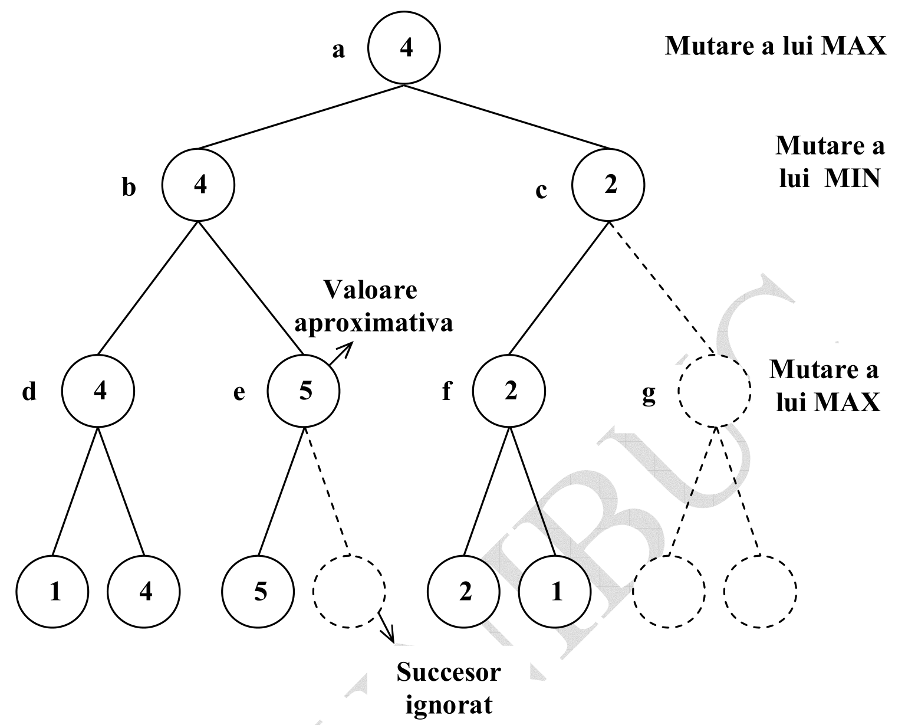

Subiecte pentru examenul de inteligenta artificiala
=========================================

[TOC]


#Teorie

## 1. Cautarea de tip breadth-first. Prezentare generala si implementare in Prolog


###Explicatie academica

Strategia de cautare de tip breadth-first extinde mai intai nodul radacina. Apoi se extind toate nodurile generate de nodul radacina, apoi succesorii lor si asa mai departe. In general, toate nodurile aflate la adancimea $d$ in arborele de cautare sunt extinse inaintea nodurilor aflate la adancimea $d + 1$. Spunem ca aceasta este o cautare in latime.

Strategia breadth-first este foarte sistematica deoarece ia in consideratie toate drumurile de lungime $1$, apoi pe cele de lungime $2$, etc. Daca exista o solutie, este sigur ca aceasta metoda o va gasi, iar daca exista mai multe solutii, cautarea de tip breadth-first va găsi întotdeauna mai întâi solutia cel mai putin adanca.

Cautarea tip breadth-first este completa si este optima cu conditia ca costul drumului sa fie o functie descrescatoare de adancimea nodului. Aceasta conditie este de obicei satisfacuta numai atunci cand toti operatorii au acelasi cost.

Algoritmul are o complexitate exponentiala de $O(\text{factorul de ramificare})^\text{lungimea drumului}$.


###Explicatie de student

Pleca de la un nod initial si incearca sa se extina. La urmatorul pas are toti fii de nivel 1, si tot asa.

Pe masura ce parcuge, se tot intreaba: este nodul ce il extind un nod scop pentru mine?

###Implementare

```
rezolva_b( Start, Solutie) :- breadthfirst([[Start]], Solutie). % nodul de start e pus intr-o lista de liste

breadthfirst([[Nod | Drum] | _] , [Nod | Drum]) :- scop(Nod).
breadthfirst([Drum | Drumuri], Solutie) :- extinde(Drum, DrumNou), concateneteaza(Drumuri, DrumNou, D1), breadthfirst(D1, Solutie). % rezultatul concatenarii e pus in D1

extinde([Nod | Drum], DrumNou) :- bagof([NodNou, Nod | Drum], (s(Nod, NodNou), \+(membru(NodNou, [Nod | Drum]))), DrumNou), !. % s e relatia de succesiune, implementata in functie de cerinta problemei ,
extinde(_, []). % daca cel de mai sus da fail, intoarce o lista vida
```

Predicatul ``rezolva_b(Start, Solutie)`` este adevarat dacă ``Solutie`` este un drum (in ordine inversa) de la nodul initial ``Start`` la o stare-scop, drum obtinut folosind căutarea de tip breadth-first.

Predicatul ``breadthfirst(Drumuri, Solutie)`` este adevarat daca un drum din multimea de drumuri candidate numita ``Drumuri`` poate fi extins la o stare-scop; un astfel de drum este ``Solutie``.

Predicatul ``extinde(Drum, DrumuriNoi)`` este adevarat daca prin extinderea multimii de noduri ``Drum`` obtinem multimea numita ``DrumuriNoi``, el generand multimea tuturor extensiilor acestui drum.

Predicatul ``concateneaza(Drumuri, DrumuriNoi, D1)`` este adevarat daca, atunci cand concatenam lista de noduri ``Drumuri`` cu lista de noduri ``DrumuriNoi``, obtinem lista de noduri ``D1``.


## 2. Cautarea de tip depth-first. Prezentare generala si implementare in Prolog

###Explicatie academica

Strategia de cautare de tip depth-first extinde intotdeauna unul dintre nodurile aflate la nivelul cel mai adanc din arbore. Cautarea se intoarce inapoi si sunt extinse noduri aflate la adancimi mai mici numai atunci cand a fost atins un nod care nu reprezinta un nod-scop si care nu mai poate fi extins. Spunem ca aceasta este o cautare în adancime.

Algoritmul are o complexitate de timp exponentiala de $O(\text{factorul de ramificare})^\text{adancime maxima}$.

###Explicatie de student

Se pleaca de la un nod de start, ii sunt extinsi fii dupa care se merge in adancime, se extinde pe cel din stanga, fii celui din stanga si tot asa pana cand nu mai am de extins. Se intoarce si parcurge in partea cealalta.

###Implementare

```
rezolva_d(Nodul_curent, Solutie) :- depthfirst([], Nodul_curent, Solutie).

depthfirst(Drum, Nod, [Nod | Drum]) :- scop(Nod).
depthfirst(Drum, Nod, Solutie) :- s(Nod, N1), \+membru(N1, Drum), depthfirst([Nod | Drum], N1, Solutie).
```

Problema gasirii unui drum solutie de la nodul ``Nod`` dat la un nod scop se rezolva astfel:
- daca ``Nod`` este un nod scop atunci este solutie
- daca exista un succesor ``N1`` al lui ``Nod`` astfel incat sa existe un drum de la ``Nod`` la un nod scop atunci se adauga la ``Solutie``


## 3. Cautarea in adancime iterativa. Prezentare generala si implementare in Prolog

###Explicatie academica

Cautarea in adancime iterativa este o strategie care evita chestiunea stabilirii unei adancimi optime la care trebuie căutată solutia, prin testarea tuturor limitelor de adancime posibile: mai intai adancimea 0, apoi 1, apoi 2, etc.

Acest tip de cautare combina beneficiile cautarii breadth-first ai depth-first:
- este optima si completa ca si cautarea breadth-first;
- consuma numai cantitatea mica de memorie necesara cautarii depth-first (cerinta de memorie este liniara).

Ordinea extinderii starilor este similara cu cea de la cautarea de tip breadth-first, numai ca anumite stari sunt extinse de mai multe ori. Aceasta strategie de cautare garanteaza gasirea nodului-scop de la adancimea minima, daca un scop poate fi gasit. Desi anumite noduri sunt extinse de mai multe ori, numarul total de noduri extinse nu este mult mai mare decat cel dintr-o cautare de tip breadth-first.

Complexitatea de timp este $O(\text{factorul de ramificare})^\text{adancime}$ si cea de spatiu $O(\text{factorul de ramificare} * \text{adancime})$.

###Implementare

```
cale(Nod, Nod, [Nod]).
cale(PrimNod, UltimNod, [UltimNod | Drum]) :- cale(PrimNod, PenultimNod, Drum), s(PenultimNod, UltimNod), \+(membru(UltimNod, Drum)).

depth_first_iterative_deepening(Nod, Sol) :- cale(Nod, NodScop, Sol),  scop(NodScop), !.
```

Predicatul ``cale(Nod1, Nod2, Drum)`` este adevarat daca ``Drum`` reprezina o cale aciclica intre nodurile ``Nod1`` si ``Nod2``. Aceasta cale este reprezentata ca o lista de noduri data in ordine inversa.

Corespunzator nodului de start dat, predicatul ``cale`` genereaza toate drumurile aciclice posibile de lungime care creste cu cate o unitate. Drumurile sunt geenrate pana cand se genereaza o cale care se termina cu un nod scop.


## 4. Algoritmul A*. Textul algoritmului si admisibilitatea acestuia

###Textul algoritmului

1. Creeaza un graf de cautare $G$, constand numai din nodul initial $n_0$. Plaseaza $n_0$ intr-o lista numita ``OPEN``.

2. Creeaza o lista numita ``CLOSED``, care initial este vida.

3. Daca lista ``OPEN`` este vida, ``EXIT`` cu esec.

4. Selecteaza primul nod din lista ``OPEN,`` inlatura-l din ``OPEN`` si plaseaza-l in lista ``CLOSED``. Numeste acest nod $n$.

5. Daca $n$ este un nod scop, opreste executia cu succes. Returneaza solutia obtinuta urmand un drum de-a lungul pointerilor de la $n$ la $n_0$ in $G$.

6. Extinde nodul $n$, generand o multime, $M$, de succesori ai lui care nu sunt deja stramosi ai lui $n$ in $G$. Instaleaza acesti membri ai lui M ca succesori ai lui $n$ in $G$.

7. Stabileste un pointer catre $n$ de la fiecare dintre membrii lui $M$ care nu se gaseau deja in $G$ (adica nu se aflau deja nici in ``OPEN``, nici in ``CLOSED``). Adauga acesti membri ai lui $M$ listei ``OPEN``. Pentru fiecare membru, $m$, al lui $M$, care se afla deja in ``OPEN`` sau in ``CLOSED``, redirectioneaza pointerul sau catre $n$, daca cel mai bun drum la $m$ gasit pana in acel moment trece prin $n$. Pentru fiecare membru al lui $M$ care se afla deja in lista ``CLOSED``, redirectioneaza pointerii fiecaruia dintre descendentii sai din $G$ astfel incat acestia sa tinteasca inapoi de-a lungul celor mai bune drumuri pana la acesti descendenti, gasite pana in acel moment.

8. Reordoneaza lista ``OPEN`` in ordinea valorilor crescatoare ale functiei $\hat{f}$. (Eventuale legaturi intre valori minimale ale lui $\hat{f}$ sunt rezolvate in favoarea nodului din arborele de cautare aflat la cea mai mare adancime).

9.  Mergi la pasul 3.

###Admisibilitatea

- Orice nod al grafului, daca admite succesori, are un numar finit de succesori
- Toate arcele din graf au costuri mai mari decat o cantitate pozitiva $\epsilon$
- Pentru toate nodurile $n$ din graful de cautare, $\hat{h}(n) \leq h(n)$ AKA $\hat{h}$ nu supraestimeaza niciodata valoarea efectiva $h$


## 5. Admisibilitatea si optimalitatea Algoritmului A*

###Admisibilitatea

- Orice nod al grafului, daca admite succesori, are un numar finit de succesori
- Toate arcele din graf au costuri mai mari decat o cantitate pozitiva $\epsilon$
- Pentru toate nodurile $n$ din graful de cautare, $\hat{h}(n) \leq h(n)$ AKA $\hat{h}$ nu supraestimeaza niciodata valoarea efectiva $h$

###Optimalitatea

Fie $G$ o stare scop optimala cu un cost al drumului notat cu $f^*$.

Fie $G_2$ o a doua stare scop, sub-optimala, care este o stare scop cu un cost al drumului $g(G_2) > f^*$.

Presupunem ca algoritmul A* selecteaza din coada, pentru extindere, pe $G_2$. Intrucat $G_2$ este o stare scop, aceasta alegere ar incheia cautarea cu o stare suboptimala. Vom arata ca acest lucru nu este posibil.


Fie un nod $n$ care este, la pasul curent, un nod frunza pe un drum optim la $G$. Pentru acest nod $n$, intruncat $h$ este admisibila trebuie sa avem $f^* \geq f(n)$. Mai mult, daca $n$ nu este ales pentru extindere in favoarea lui $G_2$, trebuie sa avem $f(n) \geq g(G_2)$.

Combinand aceste doua relatii avem $f^* \geq f(G_2)$. Dar, deoarece $G_2$ este o stare scop, avem $h(G_2) = 0$. Prin urmare $f(G_2) = g(G_2)$.

Am aratat ca $f^* \geq g(G_2)$ ceea ce contrazice faptul ca $G_2$ este sub-optimal.

In concluzie, A* nu selecteaza niciodata pentru extindere un nod sub-optimal. A* intoatece o solutie numai dupa ce a selecta-o pentru extindere $\implies$ A* este un algoritm optim.


## 6. Implementarea in Prolog a cautarii de tip best-first

Cele 3 principii ale best-first-ului:
- avem o functie euristica $\hat{f}$ si sunt preferate valorile mici ale lui $\hat{f}$
- se extinde nodul cu cel mai mic $\hat{f}$
- ne oprim cand am ajuns la un nod-scop

```
% Best-first de la profa:

% Predicatul bestfirst(Nod_initial, Solutie) este adevarat daca Solutie este un drum (obtinut folosind strategia best-first) de la nodul Nod_initial la o stare scop

bestfirst(Nod_initial,Solutie) :- expandeaza([], l(Nod_initial, 0/0), 9999999, _ , da, Solutie).
expandeaza(Drum, l(N, _), _, _, da, [N | Drum]) :- scop(N).

% Caz 1: daca N este nod scop, atunci construim o cale solutie

expandeaza(Drum, l(N, F/G), Limita, Arb1, Rez, Sol) :- F =< Limita, (bagof(M/C, (s(N, M, C), \+ (membru(M, Drum))), Succ), !, listasucc(G, Succ, As), cea_mai_buna_f(As, F1), expandeaza(Drum, t(N, F1/G, As), Limita, Arb1, Rez, Sol) ; Rez = imposibil).

%  Caz 2: Daca N este nod frunza a carui f^ -valoare este mai mica decat Limita,atunci ii generez succesorii si ii expandez in limita Limita

expandeaza(Drum, t(N, F/G, [A | As]), Limita, Arb1, Rez, Sol) :- F =< Limita, cea_mai_buna_f(As, BF), min(Limita, BF, Limita1), expandeaza([N | Drum], A, Limita1, A1, Rez1, Sol), continua(Drum, t(N, F/G, [A1 | As]), Limita, Arb1, Rez1, Rez, Sol).

%  Caz 3 Daca arborele de radacina N are subarbori nevizi si f^ -valoarea este mai mica decat Limita, atunci expandam cel mai "promitator" subarbore al sau; in functie de rezultatul obtinut Rez vom decide cum anume vom continua cautarea prin intermediul procedurii (predicatului) continua

expandeaza(_, t(_, _, []), _, _, imposibil, _) :- !.

% Caz 4: pe aceasta varianta nu o sa obtinem niciodata o solutie

expandeaza(_, Arb, Limita, Arb, nu,_) :- f(Arb, F), F > Limita.

% Caz 5: In cazul unor f^ -valori mai mari decat Bound, arborele nu
% mai poate fi extins

continua(_, _, _, _, da, da, _).
continua(P, t(N, _/G, [A1 | As]), Limita, Arb1, nu, Rez, Sol) :- insereaza(A1, As, NAs), cea_mai_buna_f(NAs, F1), expandeaza(P, t(N, F1/G, NAs), Limita, Arb1, Rez, Sol).
continua(P, t(N, _/G, [_ | As]), Limita, Arb1, imposibil, Rez, Sol) :- cea_mai_buna_f(As, F1), expandeaza(P, t(N, F1/G, As), Limita, Arb1, Rez, Sol).

listasucc(_, [], []).
listasucc(G0, [N/C | NCs], Ts) :- G is G0 + C, h(N, H), F is G + H, listasucc(G0, NCs, Ts1), insereaza(l(N, F/G), Ts1, Ts).

%  Predicatul insereaza(A,As,As1) este utilizat pentru inserarea unui arbore A intr-o lista de arbori As, mentinand ordinea impusa de f^ -valorile lor

insereaza(A, As,[A | As]) :- f(A, F), cea_mai_buna_f(As, F1),F =< F1, !.
insereaza(A, [A1 | As],[A1 | As1]):-insereaza(A, As, As1).

min(X, Y, X) :- X =< Y, !.
min(_, Y, Y).

f(l(_, F/_), F). % f-val unei frunze
f(t(_, F/_, _), F). % f-val unui arbore

%  Predicatul cea_mai_buna_f(As,F) este utilizat pentru a determina cea mai buna f^ -valoare a unui arbore din lista de arbori As, daca aceasta lista este nevida; lista As este ordonata dupa f^ -valorile subarborilor constituenti

cea_mai_buna_f([A | _], F) :- f(A, F).
cea_mai_buna_f([], 999999).

% In cazul unei liste de arbori vide, f^ -valoarea determinata este foarte mare
```


## 7. Algoritmul Minimax. Textul algoritmului si implementarea in Prolog

###Textul algoritmului

MAX = calculator
MIN = oponent

1. Se genereaza intregul arbore de joc pana la starile terminale
2. Se aplica o functie de utilitate( de evaluare - echivalentul functiei euristice) care obtine valoarea corespunzatoare fiecareia dintre starile finale
3. Ne deplasam de la frunze catre radacina si populam fiecare dintre nodurile parinte in functie de urmatoarele reguli de propagare: Daca ne aflam la un nod parinte de pe nivelul MAX, atunci nodul respeciv ia valoarea $max( \text{fiu } 1, \text{ fiu } 2)$, altfel $min( \text{fiu } 1, \text{ fiu } 2)$
4. Se alege pentru MAX mutarea care duce la valoarea maxima $\implies$ decizie minimax AKA i se da nodului radacina valoarea maxima dintre valorile de adancime $1$ fata de el.

###Implementare

```
minimax( Poz, SuccBun, Val) :- mutari(Poz, ListaPoz), !, celmaibun(ListaPoz, SuccBun, Val) ; staticval(Poz, Val).

celmaibun([Poz], Poz, Val) :- minimax(Poz, _, Val), !.
celmaibun([Poz1 | ListPoz], PozBun, ValBun) :- minimax(Poz1, _, Val1), celmaibun(ListPoz, Poz2, Val2), maibine(Poz1, Val1, Poz2, Val2, PozBun, ValBun).

maibine(Poz0, Val0, Poz1, Val1, Poz0, Val0) :- mutaremin(Poz0), Val0 > Val1, !, ; mutaremax(Poz0), Val0 < Val1, !.
maibine(Poz0, Val0, Poz1, Val1, Poz1, Val1).

% mutari si staticval se implementeaza in functie de problema - acolo sunt regulile jocului
```

Decizia ``minimax`` pentru pozitia ``Poz`` este ``SuccBun`` cu valoarea asociala ``Val``. ``SuccBun`` reprezentand mutarea optima care il avantajeaza pe jucatorul MAX, aka calculator.

Predicatul ``mutari`` pleaca de la pozitia ``Poz`` si genereaza o lista de mutari posibile in ``ListaPoz`` folosinduse de regulile de mutari legale pentru joc.

Predicatul ``celmaibun`` identifica cea mai avantajoasa mutare dintre cele din ``ListaPoz`` si le intoarce in ``SuccBun`` cu valoarea ``Val`` asociata. Daca de la ``Poz`` nu mai pot fi efectuate mutari atunci ``Poz`` este evaluat static obtinand valoarea ``Val``. Daca lista de mutari posibile contine un singur element si anume ``Poz``, atunci acest element este evaluat cu predicatul ``minimax``. Altfel fiecare dintre mutarile posibile din ``ListaPoz`` sunt evaluate iar la final predicatul ``maibine`` stabileste care dintre mutari il avantajeaza pe jucatorul MAX.

Predicatul ``maibine`` alege ``Poz0`` ca fiind avantajoasa daca jucatorul MIN efectueaza o mutare la acea pozitie ``Poz0`` iar mutarea respectiva il ajuta pe MAX, care este nodul parinte, sa obtina un rezultat bun( adica remiza sau castig) sau daca jucatorul MAX este cel care efectueaza mutarea la ``Poz0`` si obtine o valoarea ``Val0`` cu ``Val0`` cea mai mica dintre succesori pentru configuratia data.


## 8. Algoritmul Alpha-Beta. Prezentare generala (cu un exemplu) si implementare in Prolog

###Prezentare generala academica

Atunci cand strategia alpha-beta retezare este aplicata unui arbore de tip minimax standard, ea va intoarce aceeasi mutare pe care ar fi furnizat-o si Algoritmul MiniMax, dar intr-un timp mai scurt, intrucat realizeaza o retezare a unor ramuri ale arborelui care nu pot influenta decizia finala.

Principiul general al acestei tehnici consta in a considera un nod oarecare $n$ al arborelui, astfel incat jucatorul poate alege sa faca o mutare la acel nod. Daca acelasi jucator dispune de o alegere mai avantajoasa, $m$, fie la nivelul nodului parinte al lui $n$, fie in orice punct de decizie aflat mai sus in arbore, atunci $n$ nu va fi niciodata atins in timpul jocului.

Ideea tehnicii de alpha-beta retezare este aceea de a gasi o mutare "suficient de buna", nu neaparat cea mai buna, dar suficient de buna pentru a lua decizia corecta.

Aceasta idee poate fi formalizata prin introducerea a doua limite, alpha şi beta, reprezentand limitari ale valorii de tip minimax corespunzatoare unui nod intern. Semnificatia acestor limite este urmatoarea: alpha este valoarea minima pe care este deja garantat ca o va obtine MAX, iar beta este valoarea maxima pe care MAX poate spera sa o atinga. Din punctul de vedere al jucatorului MIN, beta este valoarea cea mai nefavorabila pentru MIN pe care acesta o va atinge. Prin urmare, valoarea efectiva care va fi gasita se afla între alpha şi beta. Valoarea alpha, asociata nodurilor de tip MAX, nu poate niciodata sa descreasca, iar valoarea beta, asociata nodurilor de tip MIN, nu poate niciodata sa creasca.


Cele doua reguli pentru incheierea cautarii, bazata pe valori alpha şi beta, pot fi formulate dupa cum urmeaza:
1. Cautarea poate fi oprita dedesubtul oricarui nod de tip MIN care are o valoare beta mai mica sau egala cu valoarea alpha a oricaruia dintre stramoşii sai de tip MAX.
2. Cautarea poate fi oprita dedesubtul oricarui nod de tip MAX care are o valoare alpha mai mare sau egala cu valoarea beta a oricaruia dintre stramoşii sai de tip MIN.



###Prezentare generala de student

Functioneaza cam ca si minimax, dar intoarce rezultatul intrun timp mult mai scurt, retezand ramurile stiind ca acolo nu poate sa obtina o solutie mai buna.

###Implementare

```
alphabeta(Poz, Alpha, Beta, PozBuna, Val) :-
	mutari(Poz, ListaPoz), !,
	limitarebuna(ListaPoz, Alpha, Beta, PozBuna, Val);
	staticval(Poz, Val).

limitarebuna([Poz | ListaPoz], Alpha, Beta, PozBuna, ValBuna) :-
	alphabeta(Poz, Alpha, Beta, _, Val),
	destuldebun(ListaPoz, Alpha, Beta, Poz, Val, PozBuna, ValBuna).

destuldebun([], _, _, Poz, Val, Poz, Val) :- !.
destuldebun(_, Alpha, Beta, Poz, Val, Poz, Val) :-
	mutare_min(Poz), Val > Beta, !;
	mutare_max(Poz), Val < Alpha, !.
destuldebun(ListaPoz, Alpha, Beta, Poz, Val, PozBuna, ValBuna) :-
	limitenoi(Alpha, Beta, Poz, Val, AlphaNou, BetaNou),
	limitarebuna(ListaPoz, AlphaNou, BetaNou, Poz1, Val1),
	maibine(Poz, Val, Poz1, Val1, PozBuna, ValBuna).

limitenoi(Alpha, Beta, Poz, Val, Val, Beta) :-
	mutare_min(Poz), Val > Alpha, !.
limitenoi(Alpha, Beta, Poz, Val, Alpha, Val) :-
	mutare_max(Poz), Val < Beta, !.
limitenoi(Alpha, Beta, _, _, Alpha, Beta).

maibine(Poz0, Val0, Poz1, Val1, Poz0, Val0) :-
	mutare_min(Poz0), Val0 > Val1, !;
	mutare_max(Poz0), Val0 < Val1, !.
maibine(Poz0, Val0, Poz1, Val1, Poz1, Val1).
```


## 9. Reprezentarea cunostintelor cu reguli if-then. Interpretor pentru reguli in cazul inlantuirii inapoi (implementare in Prolog)

###Reprezentarea cunostintelor cu reguli if-then
Regulile de tip if-then, numite si reguli de productie, constituie o forma naturala de exprimare a cunostintelor si au urmatoarele caracteristici suplimentare:

- Modularitate: fiecare regula defineste o cantitate de cunostinte relativ mica si independenta de celelalte.
- Incrementabilitate: noi reguli pot fi adaugate bazei de cunostinte în mod relativ independent de celelalte reguli.
- Modificabilitate (ca o consecinta a modularitatii): regulile vechi pot fi modificate relativ independent de celelalte reguli.
- Sustin transparenta sistemului.

Regulile de tip if-then adesea definesc relatii logice intre conceptele apartinand domeniului problemei. Relatiile pur logice pot fi caracterizate ca apartinand asa-numitelor cunostinte categorice, adica acelor cunostinte care vor fi intotdeauna adevarate.

In unele domenii insa, cum ar fi diagnosticarea în medicina, predomina cunoştintele “moi” sau probabiliste. In cazul acestui tip de cunostinte, regularitatile empirice sunt valide numai pana la un anumit punct (adesea, dar nu întotdeauna).

In astfel de cazuri, regulile de productie pot fi modificate prin adaugarea la interpretarea lor logica a unei calificari de verosimilitate, obtinandu-se reguli de forma urmatoare: ``if conditie A then concluzie B cu certitudinea F ``.

###Interpretor pentru reguli in cazul inlantuirii inapoi

```
:- op(800, fx, if).
:- op(700, xfx, then).
:- op(300, xfy, or).
:- op(200, xfy, and).

este_adevarat(P) :- fapta(P).

este_adevarat(P):-
        if Conditie then P,
        este_adevarat(Conditie).

este_adevarat(P1 and P2):-
        este_adevarat(P1),
        este_adevarat(P2).

este_adevarat(P1 or P2):-
        este_adevarat(P1)
        ;
        este_adevarat(P2).
```


## 10. Reprezentarea cunostintelor cu reguli if-then. Interpretor pentru reguli in cazul inlantuirii inainte (implementare in Prolog)

###Reprezentarea cunostintelor cu reguli if-then
Regulile de tip if-then, numite si reguli de productie, constituie o forma naturala de exprimare a cunostintelor si au urmatoarele caracteristici suplimentare:

- Modularitate: fiecare regula defineste o cantitate de cunostinte relativ mica si independenta de celelalte.
- Incrementabilitate: noi reguli pot fi adaugate bazei de cunostinte în mod relativ independent de celelalte reguli.
- Modificabilitate (ca o consecinta a modularitatii): regulile vechi pot fi modificate relativ independent de celelalte reguli.
- Sustin transparenta sistemului.

Regulile de tip if-then adesea definesc relatii logice intre conceptele apartinand domeniului problemei. Relatiile pur logice pot fi caracterizate ca apartinand asa-numitelor cunostinte categorice, adica acelor cunostinte care vor fi intotdeauna adevarate.

In unele domenii insa, cum ar fi diagnosticarea în medicina, predomina cunoştintele “moi” sau probabiliste. In cazul acestui tip de cunostinte, regularitatile empirice sunt valide numai pana la un anumit punct (adesea, dar nu întotdeauna).

In astfel de cazuri, regulile de productie pot fi modificate prin adaugarea la interpretarea lor logica a unei calificari de verosimilitate, obtinandu-se reguli de forma urmatoare: ``if conditie A then concluzie B cu certitudinea F ``.

###Interpretor pentru reguli in cazul inlantuirii inainte

```
inainte:-
         fapta_noua_dedusa(P),          % o noua fapta
        !,
        write(’Dedus:’), write(P), nl,
        assert(fapta (P)),
        inainte                         % continua
        ;
        write(’Nu mai exista fapte’).   % Toate faptele au fost deduse

fapta_noua_dedusa(Concl):-
        if Cond then Concl,             % o regula
        not fapta(Concl),               % Concluzia regulii nu este inca o fapta
        fapta_compusa(Cond).            % Conditia este adevarata?

fapta_compusa(Cond):-                   % fapta simpla
        fapta(Cond).

fapta_compusa(Cond1 and Cond2):-
        fapta_compusa(Cond1),           % Ambii conjuncti
        fapta_compusa(Cond2).           % sunt adevarati

fapta_compusa(Cond1 or Cond2):-
        fapta_compusa(Cond1)
        ;
        fapta_compusa(Cond2).
```


##11. Generarea explicatiilor si introducerea incertitudinii in sistemele expert. Implementare in Prolog

###Generarea explicatiilor

Regulile de productie faciliteaza generarea raspunsului pentru urmatoarele doua tipuri de intrebari ale utilizatorului:
- Intrebare de tipul “cum”: Cum ai ajuns la aceasta concluzie?
- Intrebare de tipul “de ce”: De ce te intereseaza aceasta informatie?

In cazul intrebarilor de tipul “cum”, explicatia pe care sistemul o furnizeaza cu privire la modul in care a fost dedus raspunsul sau constituie un arbore de demonstratie a modului in care concluzia finala decurge din regulile şi faptele aflate in baza de cunoştinte.

Fie ``“<=”`` un operator infixat. Atunci arborele de demonstratie al unei propozitii poate fi reprezentat in una dintre urmatoarele forme, in functie de necesitati:
1. Daca ``P`` este o fapta, atunci arborele de demonstratie este ``P``.
2.  Daca ``P`` a fost dedus folosind o regula de forma ``if Cond then P`` atunci arborele de demonstratie este ``P <= DemCond`` unde ``DemCond`` este un arbore de demonstratie a lui ``Cond``.
3. Fie ``P1`` şi ``P2`` propozitii ale caror arbori de demonstratie sunt ``Dem1`` şi ``Dem2``. Daca ``P`` este de forma ``P1 and P2``, atunci arborele de demonstratie corespunzator este ``Dem1`` and ``Dem2``. Daca ``P`` este de forma ``P1 or P2``, atunci arborele de demonstratie este fie ``Dem1``, fie ``Dem2``.

Constructia arborilor de demonstratie in Prolog este directa:

```
% este_adevarat(P,Dem) daca Dem constituie o demonstratie a faptului ca P este adevarat

:-op(800,xfx,<=).

este_adevarat(P,P):-
        fapta(P).
este_adevarat(P,P<= DemCond):-
                if Cond then P,
                este_adevarat(Cond,DemCond).
este_adevarat(P1 and P2, Dem1 and Dem2):-
                este_adevarat(P1,Dem1),
                este_adevarat(P2,Dem2).
este_adevarat(P1 or P2, Dem):-
        este_adevarat(P1,Dem)
        ;
        este_adevarat(P2,Dem).
```

###Introducerea incertitudinii

Incertitudinea poate fi modelata prin atribuirea unei calificari, alta decat adevarat sau fals, majoritatii asertiunilor.

Gradul de adevar poate fi exprimat prin intermediul unui numar real aflat intr-un anumit interval - spre exemplu, un numar intre $0$ si $1$ sau intre $-5$ si $+5$. Astfel de numere cunosc, in literatura de specialitate, o intreaga varietate de denumiri, cum ar fi factor de certitudine, masura a increderii sau certitudine subiectiva.

Fiecarei propozitii i se va adauga un numar intre $0$ si $1$ ca factor de certitudine. Reprezentarea folosita va consta dintr-o pereche de forma: ``Propozitie: FactorCertitudine``.

Aceasta notatie va fi aplicata si regulilor. Astfel, urmatoarea forma va defini o regula si gradul de certitudine pana la care acea regula este valida: ``If Conditie then Concluzie: Certitudine``.

In cazul oricarei reprezentari cu incertitudine este necesara specificarea modului in care se combina certitudinile propozitiilor si ale regulilor.

Spre exemplu, sa presupunem ca sunt date doua propozitii $P1$ si $P2$ avand certitudinile $c(P1)$ si respectiv $c(P2)$. Atunci putem defini $c(P1 \text{ and } P2) = \text{ min }(c(P1), c(P2))$, $c(P1 \text{ or } P2) =  \text{ max } (c(P1), c(P2))$

Daca exista regula ``if P1 then P2: C`` cu C reprezentand factorul de certitudine, atunci $c(P2) = c(P1) * C$

Implementarea in Prolog a unui interpretor de reguli corespunzator schemei de incertitudine descrise presupune specificarea de catre utilizator a estimatiilor de certitudine corespunzatoare datelor observate (nodurile cel mai din stanga ale retelei) prin relatia dat(Propozitie, Certitudine).

```
% certitudine (Propozitie,  Certitudine)

certutudine(P, Cert):-
	dat(P, Cert).

certitudine(Cond1 and Cond2,  Cert):-
	certitudine(Cond1, Cert1),
	certitudine(Cond2, Cert2),
	minimum(Cert1, Cert2, Cert).

certitudine(Cond1 or Cond2,  Cert):-
	certitudine(Cond1, Cert1),
	certitudine(Cond2, Cert2),
	maximum(Cert1, Cert2, Cert).

certitudine(P, Cert):-
	if Cond then P:C1,
	certitudine(Cond, C2),
	Cert is C1 * C2.
```

---

#Exercitii

##Clasice


###Factorial
```
factorial(0, 1).
factorial(N, X) :- N > 0, N1 is N - 1, factorial(N1, Y), X is Y * N.
```

###Fibbonaci
```
fib(1, 1).
fib(2, 1).
fib(N, X) :- N > 1, N1 is N - 1, N2 is N - 2, fib(N1, X1), fib(N2, X2), X is X1 + X2.
```

###Cmmdc
```
cmmdc(X, X, X).
cmmdc(X, Y, D) :- X > Y, Z is X - Y, cmmdc(Z, Y, D).
cmmdc(X, Y, D) :- X < Y, Z is Y - X, cmmdc(X, Z, D).
```
###Cmmmc
```
cmmmc(X, Y, D) :- R is (X * Y), cmmdc(X, Y, A), D is R / A.
```

##Liste

###Manipulari

####Membru
```
membru(A, [A | _]) .
membru(A, [_ | T]) :- membru(A, T).
```

#### Adaugarea unui element in lista
```
add(A, E, [E | A]).
add([], E, [E]).
```

#### Concatenarea a 2 liste
```
concat([], L, L).
concat([H | T], L, [H | L1]) :- concat(T, L, L1).
```

#### Adaugarea unui element in lista pe o anumita pozitie
```
add_poz([H | T], E, X, [H | T1]) :- X > 1, Y is X - 1, add_poz(T, E, Y, T1).
add_poz(L, E, 1, [E | L]).
add_poz([], E, _, [E]).
```

#### Determinarea unui element de pe o anumita pozitie
```
el_poz([H | T], X) :- Y > 0, Y is X - 1, el_poz(T, Y).
el_poz([H | T], 0) :- write(H).
```

#### Adaugarea unui element in lista daca nu apare deja in lista
```
add_new(L, E, [E | L]) :- \+exista(E, L).
add_new(L, E, L) :- exista(E, L).

exista(E, [H | L]) :- exista(E, L).
exista(E, [E | L]).
```

#### Determinarea minimului dintr-o lista
```
min(X, Y, X) :- X < Y, !.
min(_, Y, Y).

minim([X], X).
minim([H | T], X) :- minim(T, X1), min(H, X1, X).
```

####Gasirea elementului de pe o anumita pozitie
```
findelempoz(1, [H | _], H).
findelempoz(P, [_ | T], Rez) :- Y is P - 1, findelempoz(Y, T, Rez).
```

####Inserarea unui element pe o anumita pozitie
```
insertelempoz(X, 1, L, [X | L]).
insertelempoz(X, P, [H | T], [H | LRez]) :- Y is P - 1, insertelempoz(X, Y, T, LRez).
```

#### Stergerea unui element din lista
```
del(E, [], []).
del(E, [E | T], T). % daca E e p e prima pozitie atunci rezultatul este T
del(E, [H | T], [H | T1]) :- del(E, T, T1).
```

####Stergerea tuturor aparitiilor unui element din lista
```
delete_all(_, [], []).
delete_all(E, [E | L], T) :- delete_all(E, L, T).
delete_all(E, [H | T], [H | T1]) :- H \== T, delete_all(E, T, T1).
```

####Inlocuirea unui element
```
replace(_, _, [], []).
replace(X, Y, [X | T], [Y | T]).
replace(X, Y, [H | T], [H | T1]) :- replace(X, Y, T, T1).
```

####Inlocuirea tuturor aparitiilor unui element din lista
```
replace_all(_, _, [], []).
replace_all(X, Y, [X | T], [Y | T]) :- replace_all(X, Y, [T | T]).
replace_all(X, Y, [H | T], [H | T1]) :- replace_all(X, Y, T, T1).
```

####Inversarea unei liste
```
reverse([], []).
reverse([H | L], R) :- reverse(L, I), concat(I, [H], R).

concat([], L, L).
concat([H | T], L, [H | L1]) :- concat(T, L, L1).
```

####Interclasarea a doua liste ordonate crescator
```
interclasare([], L, L).
interclasare(L, [], L).
interclasare([H1 | TL1], [H2 | TL2], [H2 | LRez]) :- H1 >= H2, L4 = [H1 | TL1], interclasare(L4, TL2, LRez).
interclasare([H1 | TL1], [H2 | TL2], [H1 | LRez]) :- H1 < H2, L3 = [H2 | TL2], interclasare(TL1, L3, LRez).
```

####Permutari
```
delete_pentru_perm(E, [E | T], T). % daca E e p e prima pozitie atunci rezultatul este T
delete_pentru_perm(E, [H | T], [H | T1]) :- E \== H, delete_pentru_perm(E, T, T1).

permutare([], []).
permutare([H | T], P) :- permutare(T, Q), delete_pentru_perm(H, P, Q).
```

####Lista de permutari
```
permlist(L, LP) :- bagof(P, permutare(L, P), LP).

delete_pentru_perm(E, [E | T], T). % daca E e p e prima pozitie atunci rezultatul este T
delete_pentru_perm(E, [H | T], [H | T1]) :- E \== H, delete_pentru_perm(E, T, T1).

permutare([], []).
permutare([H | T], P) :- permutare(T, Q), delete_pentru_perm(H, P, Q).
```

####Se da o lista de intrare cu numere, sa se calculeze suma a doua cate doua elemente pozitive(pt fiecare doua numere se pune suma lor ca un element in noua lista)
```
suma([], []).
suma([_], []).
suma([X, Y | L], [S | L1]) :- X >= 0, Y >= 0, S is X + Y, suma([Y | L], L1).
suma([X, Y | L], L1) :- X < 0, Y >= 0, suma([Y | L], L1).
suma([X, Y | L], L1) :- X >= 0, Y < 0, suma([X | L], L1).
suma([X, Y | L], L1) :- X < 0, Y < 0, suma(L,L1).
```

###Sortari

####Quicksort
```
quicksort([], []).
quicksort([H | T], Rez) :- divide(T, H, L1, L2), quicksort(L1, Rez1), quicksort(L2, Rez2),
					concat(Rez1, [H], RezF1), concat(RezF1, Rez2, Rez).

concat([], L, L).
concat([H | T], L, [H | L1]) :- concat(T, L, L1).

% sa se divida o lista dupa 1 valoare numerica. Elementele mai mici ca X in L1
divide([], _, [], []).
divide([H | T], X, [H | L1], L2) :- H =< X, divide(T, X, L1, L2).
divide([H | T], X, L1, [H | L2]) :- H > X, divide(T, X, L1, L2).
```

####Insertion sort
```
% inserarea unui element intro lista sortata
ins(X, [H | Ls], [H | L]) :- X >= H, ins(X, Ls, L).
ins(X, [H | L], [X, H | L]) :- X < H.

sortins([], []).
sortins([H | L], R) :- sortins(L, R1), ins(H, R1, R).
```

####Bubble sort
```
bubble(L, LRez) :- swap(L, LRez1), !, bubble(LRez1, LRez).
bubble(L, L).

% swap - gaseste prima pereche de elemente alaturate in care primul e mai mare ca al doilea si le schimba pozitiile
swap([H1 , H2 | T], [H2 , H1 | T]) :- H1 > H2.
swap([H1 , H2 | T], [H1 | LRez]) :- H1 =< H2, swap([H2 | T], LRez).
```

###Multimi

####Verificarea daca lista e o multime
```
multime([]).
multime([H | T]) :- \+membru(H, T), multime(T).

membru(X, [X | _]).
membru(X, [_ | L]) :- membru(X, L).
```

####Intersectia a doua multimi
```
intersectie([], [], []).
intersectie(A, B, C) :- setof(X, ( membru(X, A) , membru(X, B) ), C).

membru(X, [X | _]).
membru(X, [_ | L]) :- membru(X, L).
```

####Diferenta a doua multimi
```
diferenta([], [], []).
diferenta(A, B, C) :- setof(X, ( membru(X, A) , \+membru(X, B) ), C).

membru(X, [X | _]).
membru(X, [_ | L]) :- membru(X, L).
```

####Reuniunea a doua multimi
```
reuniunea([], [], []).
reuniunea(A, B, C) :- setof(X, ( membru(X, A) ; membru(X, B)), C).

membru(X, [X | _]).
membru(X, [_ | L]) :- membru(X, L).
```

##Arbori

###Creare

####Creare arbore dintr-o lista
```
creare_arb_sort([], nil).
creare_arb_sort([H | T], A) :- creare_arb_sort(T, A1), ins_arb_sort(H, A1, A).
```

####Inserarea unui nod intr-un arbore sortat
```
ins_arb_sort(X, nil, arb(nil, X, nil)).
ins_arb_sort(X, arb(S, X, D), arb(S, X, D)).
ins_arb_sort(X, arb(S, R, D), arb(S1, R, D)) :- X < R , ins_arb_sort(X, S, S1).
ins_arb_sort(X, arb(S, R, D), arb(S, R, D1)) :- X > R , ins_arb_sort(X, D, D1).
```

###Afisari

####In-ordine
```
inordine(nil).
inordine(arb(S, R, D)) :- inordine(S), write(R), write(' '), inordine(D).
```

####Pre-ordine
```
preordine(nil).
preordine(arb(S, R, D)) :- write(R), write(' '), preordine(S), preordine(D).
```

####Post-ordine
```
postordine(nil).
postordine(arb(S, R, D)) :- postordine(S), postordine(D), write(' '), write(R).
```

###Operatii

####Inaltimea
```
inaltime(nil, 0).
inaltime(arb(S, _, D), I) :- inaltime(S, I11), inaltime(D, I12), I is max(I11, I12) + 1.
```

####Lista frunzelor
```
list_frunze(nil, []).
list_frunze(arb(nil, R, nil), [R]):- !.
list_frunze(arb(S, _, D), L) :- list_frunze(S, L1), list_frunze(D, L2), concat(L1, L2, L).

concat([], L, L).
concat([H | T], L, [H | L1]) :- concat(T, L, L1).
```

####Lista nodurilor interioare
```
list_nod_interior(nil, []).
list_nod_interior(arb(nil, _, nil), []) :- !.
list_nod_interior(arb(S, R, D), [R | L]) :- list_nod_interior(S, L1), list_nod_interior(D, L2), concat(L1, L2, L).

concat([], L, L).
concat([H | T], L, [H | L1]) :- concat(T, L, L1).
```

####Lista muchiilor
```
list_muchii(nil, []).
list_muchii(arb(nil, _, nil), []).
list_muchii(arb(nil, R, arb(_, R1, D1)), [R - R1 | L]) :- list_muchii(D1, L).
list_muchii(arb(arb(S1, R1, _), R, nil), [R - R1 | L]) :- list_muchii(S1, L).
list_muchii(arb(arb(S1, R1, D1), R, arb(S2, R2, D2)), [R - R1 ,  R - R2 | L]) :-
											list_muchii(arb(S1, R1, D1), L1),
											list_muchii(arb(S2, R2, D2), L2),
											concat(L1, L2, L).

concat([], L, L).
concat([H | T], L, [H | L1]) :- concat(T, L, L1).
```

##Problemele de la lab

###Problema canibalilor si a misionarilor

```
% Membru
membru(X, [X | _]). % caz de oprire
membru(X, [_ | L]) :- membru(X, L). % caz recursiv

% Concatenarea a 2 liste
concat([], L, L).
concat([H | T], L, [H | L1]) :- concat(T, L, L1).

% Permutare a listei
delete_pentru_perm(E, [E | T], T). % daca E e p e prima pozitie atunci rezultatul este T
delete_pentru_perm(E, [H | T], [H | T1]) :- E \== H, delete_pentru_perm(E, T, T1).

permutare([], []).
permutare([H | T], P) :- permutare(T, Q), delete_pentru_perm(H, P, Q).

% Lipseste Breadth-first

% Problema canibalilor si a misionarilor
% stare(malul pe care se afla barca, numarul de misionari de pe mal, numarul de canibali, nr misionari mal opus, nr canibali masl opus, capacitatea barcii)

initial(stare(est, 3,3 ,0 ,0 ,2)).
scop(stare(vest, 3, 3, 0, 0, 2)).

opus(est, vest).
opus(vest, est).

% for(0, 4, X).
% X = 0 ;
% X = 1 ;
% X = 2 ;
% X = 3 ;
% X = 4 ;
% false.

for(A, B, A) :- A =< B.
for(A, B, X) :- A1 is A + 1, A1 =< B, for(A1, B, X).

s(stare(B, NMB, NCB, NMis, NCan, M),
  stare(B1, NMB1, NCB1, NMis1, NCan1, M)) :- M1 is min(M, NMB), M2 is min(M, NCB),
						for(0, M1, K1), for(0, M2, K2),
						(K1 >= K2 ; K1 =:= 0), K1 + K2 =< M, K1 + K2 > 0,
						NMis1 is NMB - K1, NCan1 is NCB - K2, (NMis1 >= NCan1; NMis1 =:= 0),
						NMB1 is NMis + K1, NCB1 is NCan + K2, (NMB1 >= NCB1 ; NMB1 =:= 0),
						opus(B, B1).

afisare([]).
afisare([H | T]) :- afisare(T), nl, afis(H).

afis(stare(B, NMB, NCB, NMis, NCan, M)) :- write('Barca se afla pe malul de '), write(B), nl,
						write('  pe acest mal sunt '), write(NMB), write(' misionari si '), write(NCB), write(' canibali'), nl,
						write('  pe malul opus se afla '), write(NMis), write(' misionari si '), write(NCan), write(' canibali.'), nl.

mc :- tell('/fisier.text'), initial(S), rezolva_b(S, Soll), afisare(Soll), told.

```

###Problema in care ave 2 vase de 3L si 5L si vrem sa obtinem 4L

```
% Lipseste BF

/* Rezolvat sistem de ecuatii cu BF */

scop(pct(X, Y)) :- 3 * X + 4 * Y =:= 18,
			X  - 2 * Y =:= -1.

s(pct(X, Y), pct(X , Y1)) :- Y1 is Y + 1 ; Y1 is Y - 1.
s(pct(X, Y), pct(X1 , Y)) :- X1 is X + 1 ; X1 is X - 1.

rezolva_sistem(X, Y) :- rezolva_b(pct(0, 0), [scop(X, Y) | _ ]).


/*
	Avem la dispozitie 2 vase negradate, unul de 3L si unu de 5L.
	Sa se obtina 4L stiind ca putem umple vasele, le putem goli sau putem turna din unul in altul,
		fie pana cand vasul din care turnam se goleste,
		fie pana cand vasul in care turnam se umple.
*/

initial(st(0,0)). /* initial sunt goale vasele */
scop(st(4, _)).

s(st(A, B), st(A1, B1)) :- A > 0 , A1 is 0, B1 is B ;
					/* golim A */
				B > 0, B1 is 0, A1 = A ;
					/* golim B */
				A < 5, A1 is 5, B1 = B ;
					/* umplem pe A */
				B1 < 3, B1 is 3, A1 = A ;
				 	/* umplem pe B */
				B < 3, B1 is min(3, A + B), A1 = A + B - B1;
					/* mutam din A in B */
				A < 5 , A1 is min(5, A + B), B1 is A + B - A1.
					/* mutam din B in A */

```

###Problema mutarii blocurilor
```
% Lipsesc BF, DF

% Membru
membru(X, [X | _]). % caz de oprire
membru(X, [_ | L]) :- membru(X, L). % caz recursiv

% Concatenarea a 2 liste
concat([], L, L).
concat([H | T], L, [H | L1]) :- concat(T, L, L1).

% Permutare a listei
delete_pentru_perm(E, [E | T], T). % daca E e p e prima pozitie atunci rezultatul este T
delete_pentru_perm(E, [H | T], [H | T1]) :- E \== H, delete_pentru_perm(E, T, T1).

permutare([], []).
permutare([H | T], P) :- permutare(T, Q), delete_pentru_perm(H, P, Q).

% Problema mutarii blocurilor

% Avem m blocuri si n locatii. In cazul nostru m = 4 blocuri, n = 3 locatii
% Configuratia initiala: [ [d], [a, b], [c] ] AKA a este deasupra lui b in locatia din mijloc
% Configuratia finala, la care vrem sa ajungem: [ [ ], [a, b, c, d], [ ] ] AKA gol, a peste b peste c peste d, gol

initial([[d], [a, b], [c]]).
scop([[], [a, b, c, d], []]).

% Trebuie sa scriem s-ul
s(Lista_stive, Lista_stive_rez) :- membru(X, Lista_stive),
					X = [Varf | _],
					det_poz_el(Lista_stive, N, X),
					sterg_la_n(Lista_stive, Lista_stive_inter, N),
				membru(Y, Lista_stive),
					det_poz_el(Lista_stive, N1, Y),
				N1 \== N,
				adauga_la_n(Varf, Lista_stive_inter, Lista_stive_rez, N1),
				\+ permutare(Lista_stive, Lista_stive_rez).

% Determina pozitia lui X in lista si pune pozitia in N
det_poz_el([X | _], 1, X).
det_poz_el([_ | T], Poz, X) :- det_poz_el(T, Poz1, X), Poz is Poz1 + 1.

% Se sterge primul element din stiva N si se returneaza rezultatul
sterg_la_n([[_ | T] | T1], [T, T1], 1).
sterg_la_n([H | T], [H | LRez], N) :- N > 1, N1 is N - 1, sterg_la_n(T, LRez, N1).

% Se adauga elementul Varf la lista Lista_stive_inter in stiva N1 si se intoarce rezultatul in Lista_stive_rez
adauga_la_n(Varf, [H | T], [[Varf | H] | T], 1).
adauga_la_n(Varf, [H | T], [H | LRez], N) :- N > 1, N1 is N - 1, adauga_la_n(Varf, T, LRez, N1).

pb_bf :- tell('/blocuri.text'),
	initial(S), rezolva_b(S, Solutie), afisare(Solutie), told.
pb_df :- tell('/blocuri.text'),
	initial(S), rezolva(S, Solutie), afisare(Solutie), told.

afisare([]).
afisare([H|T]) :- afisare(T), arata(H), nl.

arata(L) :- nl, max_lung(L, N), afis(L, N, N).

afis(L1, _, 0) :- af(L1).
afis(L1, N, K) :- K > 0, afis2(L1, N, K), nl, K1 is K - 1, afis(L1, N, K1).

af([]) :- write('==').
af([_ | T]) :- write('==='), af(T).

afis2([], _, _).
afis2([H | T], N, K) :- lung(H, L),
                    (L >= K, L1 is L - K + 1, det_el_n(H, L1, R), write(R) ;
                     L < K, tab(1)),
                     tab(2), afis2(T, N, K).

det_el_n([H | _], 1, H).
det_el_n([_ | T], K, H) :- K > 1, K1 is K - 1, det_el_n(T, K1, H).

/* lung(Lista,Lungime_lista) */
lung([], 0).
lung([A | L], N) :- lung(L, N1), N is N1 + 1.

/* max_lung(Lista_stive,Lungime_maxima_stiva) */
max_lung([], 0).
max_lung([H | T], N) :- lung(H, N1), max_lung(T, N2), N is max(N1, N2).
```


###X si 0
```
% X si 0 cu Minimax

% Lipseste Mini-Max

membru(X, [X | _]).
membru(X, [_ | L]) :- membru(X, L).

% 1 2 3 <- cum arata tabla
% 4 5 6
% 7 8 9

juc_opus(x, 0).
juc_opus(0, x).

tablou_initial([gol, gol, gol, gol, gol, gol, gol, gol, gol]).

% linie
tablou_final([C, C, C, _, _, _, _, _, _], C) :- C \== gol, !.
tablou_final([_, _, _, C, C, C, _, _, _], C) :- C \== gol, !.
tablou_final([_, _, _, _, _, _, C, C, C], C) :- C \== gol, !.

% coloana
tablou_final([C, _, _, C, _, _, C, _, _], C) :- C \== gol, !.
tablou_final([_, C, _, _, C, _, _, C, _], C) :- C \== gol, !.
tablou_final([_, _, C, _, _, C, _, _, C], C) :- C \== gol, !.

% diagonala
tablou_final([C, _, _, _, C, _, _, _, C], C) :- C \== gol, !.
tablou_final([_, _, C, _, C, _, C, _, _], C) :- C \== gol, !.

% remiza
tablou_final(T, gol) :- \+membru(gol, T).


mutari(Poz, ListaPoz) :- bagof(Poz1, s(Poz, Poz1), ListaPoz).

/*
	stare(J, Tablou, N, M)
		J - jucatorul care face mutarea curenta
		Tablou - lista de 9 elemente
		N - numarul maxim de mutari care se pot face in adancime
		M - jucatorul opus AKA calculatorul
*/

s(stare(J, T, N, M), stare(J1, T1, N1, M)) :- \+tablou_final(T, _), N > 0, juc_opus(J, J1), N1 is N - 1, pune(J, T, T1).

pune(J, [gol | T], [J | T]).
pune(J, [H | T], [H | T1]) :- pune(J, T, T1).

staticval(stare(_, T, _, MAX), Val) :- tablou_final(T, C), !,
					(C == MAX, Val is 99 ; juc_opus(C, MAX), Val is -99 ; C == gol, Val is 0).
staticval(stare(_, T, _, Max), Val) :- juc_opus(MIN, MAX), linii_deschise(MAX, T, D1), linii_deschise(MIN, T, D2),
					Val is D1 - D2.

linii_deschise(J, T, D) :- linia1(J, T, L1), linia2(J, T, L2), linia3(J, T, L3),
				coloana1(J, T, C1), coloana2(J, T, C2), coloana3(J, T, C3),
				diagonala1(J, T, D1), diagonala2(J, T, D2),
				D is L1 + L2 + L3 + C1 + C2 + C3 + D1 + D2.

linia1(J, [A, B, C, _, _, _, _, _, _], 1) :- juc_opus(J, J1), \+membru(J1, [A, B, C]), !.
linia1(_, _, 0).

linia2(J, [_, _, _, A, B, C, _, _, _], 1) :- juc_opus(J, J1), \+membru(J1, [A, B, C]), !.
linia2(_, _, 0).

linia3(J, [_, _, _, _, _, _, A, B, C], 1) :- juc_opus(J, J1), \+membru(J1, [A, B, C]), !.
linia3(_, _, 0).

coloana1(J, [A, _, _, B, _, _, C, _, _], 1) :- juc_opus(J, J1), \+membru(J1, [A, B, C]), !.
coloana1(_, _, 0).

coloana2(J, [_, A, _, _, B, _, _, C, _], 1) :- juc_opus(J, J1), \+membru(J1, [A, B, C]), !.
coloana2(_, _, 0).

coloana3(J, [_, _, A, _, _, B, _, _, C], 1) :- juc_opus(J, J1), \+membru(J1, [A, B, C]), !.
coloana3(_, _, 0).

diagonala1(J, [A, _, _, _, B, _, _, _, C], 1) :- juc_opus(J, J1), \+membru(J1, [A, B, C]), !.
diagonala1(_, _, 0).

diagonala2(J, [_, _, A, _, B, _, C, _, _], 1) :- juc_opus(J, J1), \+membru(J1, [A, B, C]), !.
diagonala2(_, _, 0).


mutare_max(stare(MAX, _, _, MAX)).
mutare_min(stare(MIN, _, _, MAX)) :- juc_opus(MIN, MAX).

% cu asta se face apelarea

x_si_0_minimax :- initializari(MAX, N), tablou_initial(T), afis_tablou(T), joc_minimax(stare(x, T, N, MAX)).

jucator_MAX(M) :- write('Incepe jocul...\n'), repeat, write('Vrei sa fii cu X?( da / nu)\n'), read(T),
			(T == da, M = 0 ; T == d, M = 0 ; T == nu, M = x ; T == n , M = x), !.

initializari(M, N) :- jucator_MAX(M), nl, repeat, write('Adancimea: '), read(N), integer(N), !, nl.

joc_minimax(stare(_, T, _, MAX)) :- tablou_final(T, C), !, anunt_castigator(C, MAX).
joc_minimax(stare(MAX, T, N, MAX)) :- minimax(stare(MAX, T, N, MAX), stare(MIN, T1, N1, MAX), _), write('Am mutat\n'), afis_tablou(T1), joc_minimax(stare(MIN, T1, N, MAX)).
joc_minimax(stare(MIN, T, N, MAX)) :- juc_opus(MIN, MAX), repeat, write('Linie: '), read(L), write('Coloana: '), read(C),
					P is 3 * (L - 1) + C, marcheaza(MIN, T, P, T1), !, afis_tablou(T1), joc_minimax(stare(MAX, T1, N, MAX)).

marcheaza(MIN, [gol | T], 1, [MIN | T]).
marcheaza(MIN, [H | T], P, [H | T1]) :- P > 1, P1 is P - 1, marcheaza(MIN, T, P1, T1).

anunt_castigator(J, MAX) :- J == MAX, write('Ai pierdut!\n') ; juc_opus(J, MAX), write('Ai castigat!\n') ; J == gol, write('Remiza!\n').

afis_tablou([C1, C2, C3, C4, C5, C6, C7, C8, C9]) :- write('  1 2 3 \n'),
							write('1 '), scrie_elem(C1),
							write(' '), scrie_elem(C2),
							write(' '), scrie_elem(C3), nl,
							write('2 '), scrie_elem(C4),
							write(' '), scrie_elem(C5),
							write(' '), scrie_elem(C6), nl,
							write('3 '), scrie_elem(C7),
							write(' '), scrie_elem(C8),
							write(' '), scrie_elem(C9), nl, nl.

scrie_elem(X) :- X == gol, !, write('.') ; X == x, !, write('X') ; write('0').

```

###Problema eight-puzzle

```
% Problema eight-puzzle rezolvata cu Best-first

% Lipseste best-first

% Membru
membru(X, [X | _]).
membru(X, [_ | L]) :- membru(X, L).

scop([2/2, 1/3, 2/3, 3/3, 3/2, 3/1, 2/1, 1/1, 1/2]). % configuratie a tablitei in care vrem sa ajungem

initial([1/2, 2/3, 3/3, 3/1, 2/1, 1/1, 2/2, 1/3, 3/2]). % configuratia initiala, cea de la care plecam

h1([], [], 0). % 0 casute sunt pe pozitia gresita
h1([E | T], [E1 | T1], H) :- h1(T, T1, H1), (E == E1 -> H is H1; H is H1 + 1).

distManhattan(X/Y, X1/Y1, D) :- D is abs(X - X1) + abs(Y - Y1).

h2([], [], 0). % Suma distantelor Manhattan
h2([E | T], [E1 | T1], H) :- h2(T, T1, H1), distManhattan(E, E1, H2), H is H1 + H2.

% h(s) = h2(s) + 3 * secv(s)

/*

Cine este scor:

scor: indicele placutei aflate in centrul tabloului este 1
scor: indicele unei placute aflate intro pozitie diferita de centru e 0 daca acea placuta este urmata(in sens invers trigonometric) de succesorul sau din configuratia finala
scor: in orice alta situatie indicele este egal cu 2

*/

scor(2/2, _, 1) :- !. % casuta goala

scor(1/2, 2/3, 0) :- !. % casuta pe locul ei final
scor(2/3, 3/3, 0) :- !.
scor(3/3, 3/2, 0) :- !.
scor(3/2, 3/1, 0) :- !.
scor(3/1, 2/1, 0) :- !.
scor(2/1, 1/1, 0) :- !.
scor(1/1, 1/2, 0) :- !.
scor(1/2, 1/3, 0) :- !.

scor(_, _, 2). % orice alta casuta care nu e pe pozitia pe care trebuie sa fie

h([Gol | T], H) :- scop([G1 | T1]), h2(T, T1, H2), secv(T, S), H is H2 + 3 * S.

secv([A | B], S) :- secv([A  | B], A, S).
secv([A1 , A2 | B], Prim, S) :- scor(A1, A2, S1), secv([A2 | B], Prim, S2), S is S1 + S2.
secv([U], Prim, S) :- scor(U, Prim, S).

s([G | P], [G1 | P1], 1) :- interschimbare(G, G1, P, P1).

interschimbare(G, G1, [G1 | T], [G | T]) :- distManhattan(G, G1, 1).
interschimbare(G, G1, [A | T], [A | T1]) :- interschimbare(G, G1, T, T1).

afisareSolutie([]).
afisareSolutie([A | B]) :- afisareSolutie(B), nl, afis(A).

afis([P0, P1, P2, P3, P4, P5, P6, P7, P8]) :- membru(Y, [3, 2, 1]), nl, membru(X, [1, 2, 3]),
						membru(Z - X/Y, [' ' - P0, 1 - P1, 2 - P2, 3 - P3, 4 - P4, 5 - P5, 6 - P6, 7 - P7, 8 - P8]),
						write(Z), write(' '), fail ; true.

eightPuzzle :- tell('/eight-puzzle.text'), initial(Poz), bestfirst(Poz, Sol), afisareSolutie(Sol), told.
```

---

> Written with [StackEdit](https://stackedit.io/).
